# HSound


<p align="center">
  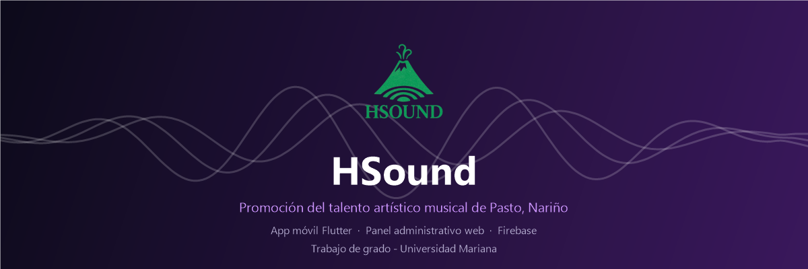
</p>

## Descripción

**HSound** es una aplicación móvil desarrollada en Flutter que conecta artistas musicales de **Pasto, Nariño** con su comunidad. Los artistas publican sus canciones mediante enlaces de **YouTube, Spotify y SoundCloud**, y los oyentes descubren música local, buscan por género o instrumento y guardan sus canciones favoritas.

El proyecto está compuesto por **dos aplicaciones Flutter** que comparten la misma base de datos en Cloud Firestore:

- **`hsound`** es la app móvil dirigida a artistas y oyentes.
- **`adminpanel_musical`** es el panel web de administración para la gestión de usuarios y contenido.

**HSound no es un sustituto de Spotify.** No almacena música en servidores propios: usa enlaces externos de plataformas que ya existen. Su valor no está en la cantidad de canciones, sino en ser un **catálogo exclusivo de artistas de Pasto** que le da visibilidad local a músicos que todavía no tienen contrato.

**HSound** es un **trabajo de grado** del programa de Ingeniería de Sistemas de la **Universidad Mariana**, presentado como requisito para obtener el título de Ingeniero de Sistemas.

## Autores

| Autor | Rol | Perfil |
|-------|-----|--------|
| Burbano Bastidas Sofía | Autora | [](https://www.linkedin.com/in/sofia-burbano-46a513341) |
| Ibarra Rosero Esneyder Jesús | Autor | [](https://www.linkedin.com/in/esneyder-ibarra-rosero) |

**Asesor:** Wilson Andrés Castillo Castro

**Institución:** [](https://www.umariana.edu.co) — Facultad de Ingeniería, Programa de Ingeniería de Sistemas, San Juan de Pasto

**Año:** 2026

## Demo en vivo

| Recurso | Enlace |
|---------|--------|
| Panel administrativo | [](https://hsound-8aad2.web.app) |
| Descarga del APK | [](https://drive.google.com/drive/folders/11coN6w5jWHiFhzWn-cMqA5BRtXO1eZn6) |

> **Nota:** el panel administrativo requiere iniciar sesión con una cuenta de administrador. El APK es la versión de la app móvil ya compilada, útil para probar en un dispositivo Android sin montar el proyecto.

## Funcionalidades principales

| Módulo | Descripción |
|--------|-------------|
|  | Registro e inicio de sesión con correo y con Google |
|  | Feed de canciones y eventos destacados de la región |
|  | Búsqueda de canciones y artistas por título, género o instrumento |
|  | Reproducción desde YouTube, Spotify y SoundCloud con el reproductor oficial de cada plataforma |
|  | Sistema de favoritos sincronizado en tiempo real |
|  | Compartir canciones y perfiles de artista en redes sociales |
|  | Biografía, foto, género musical, instrumentos y redes sociales |
|  | Publicación de canciones y eventos mediante enlaces externos |
|  | Aprobación de contenido, gestión de usuarios y reseñas |

## Capturas de pantalla

Las capturas se guardan en `assets/screenshots/` con esta estructura:

```
assets/screenshots/
├── app/       → aplicación móvil
└── admin/     → panel web de administración
```

Esta carpeta vive en la raíz del repositorio y **no** forma parte de ninguna de las dos aplicaciones Flutter, por lo que no se empaqueta en los builds ni incrementa su tamaño.

### App móvil

<p align="center">
  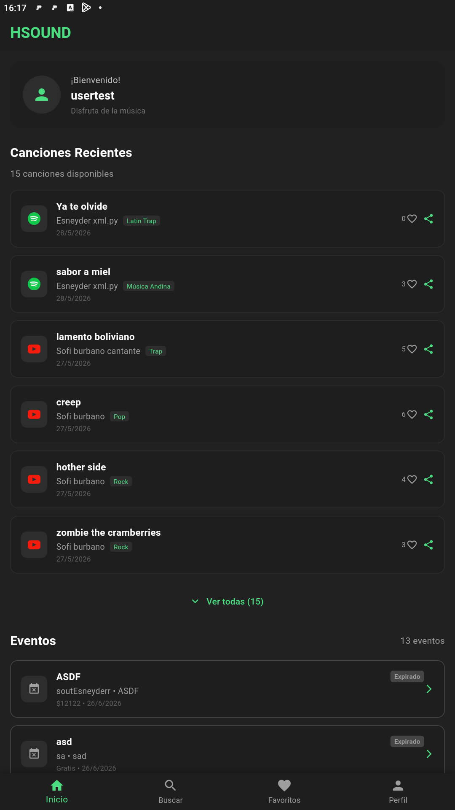
  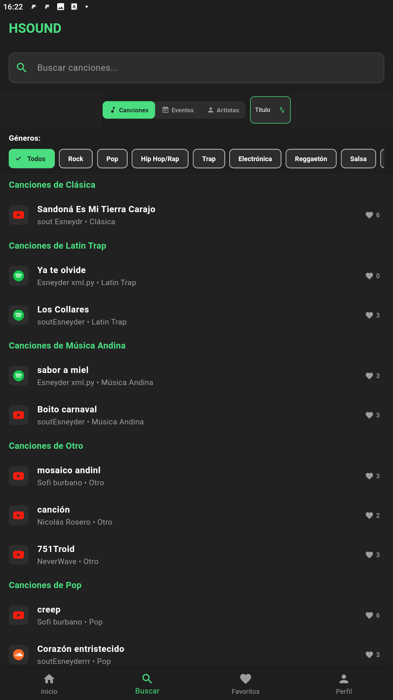
  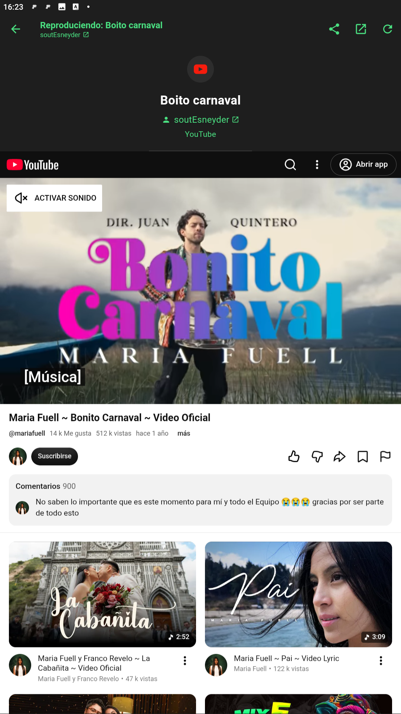
</p>

<p align="center">
  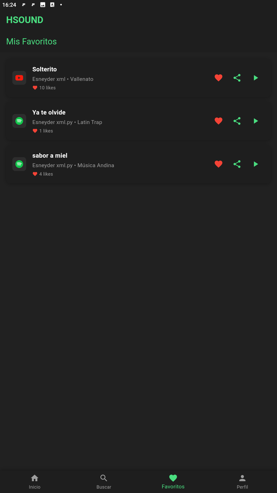
  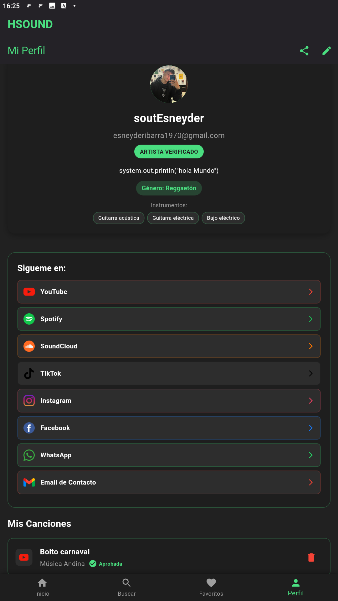
  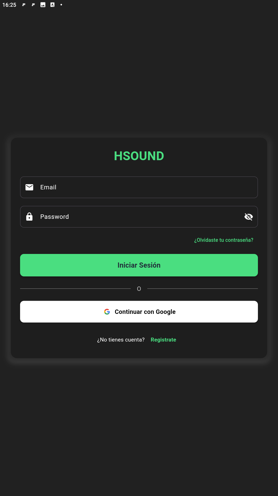
</p>

### Panel administrativo

<p align="center">
  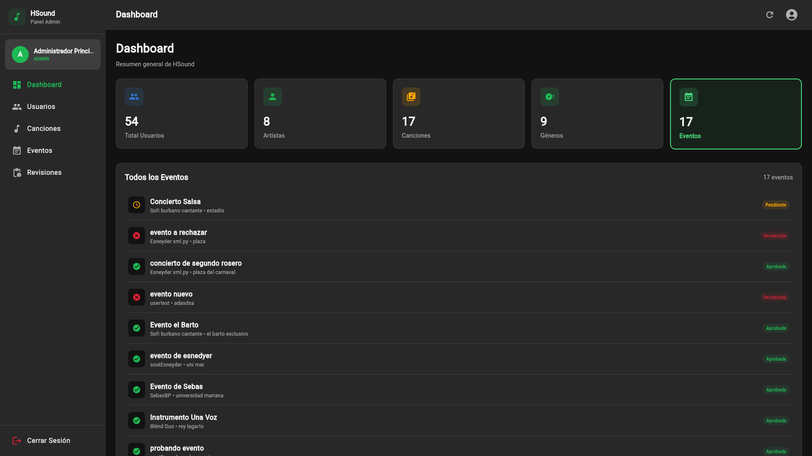
  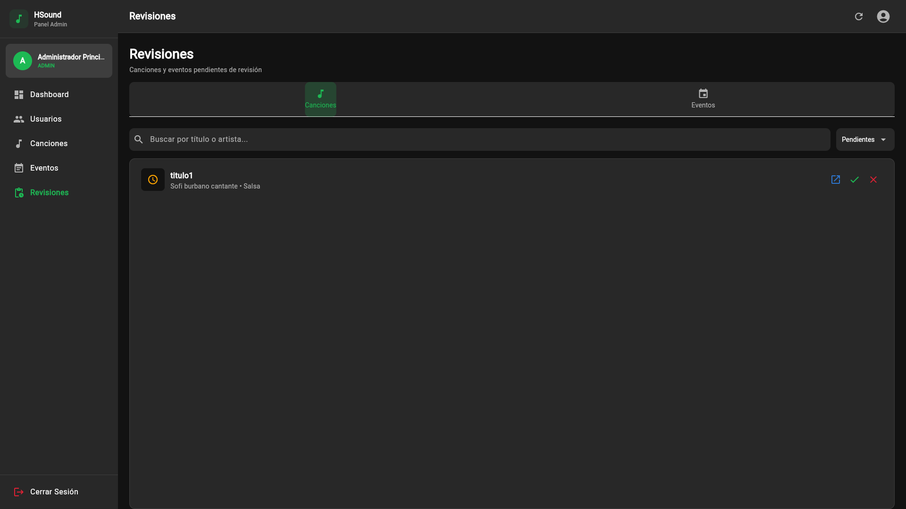
</p>

<p align="center">
  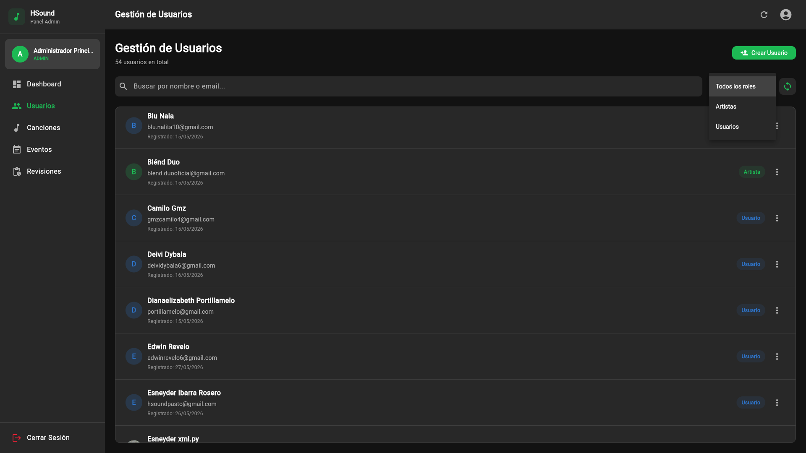
  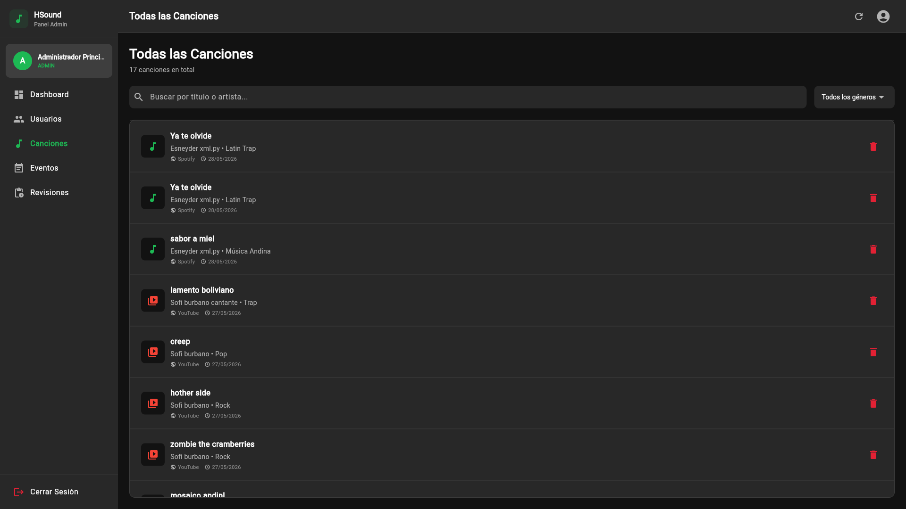
</p>

## Funcionalidades

### App móvil (`hsound`)
- **Autenticación:** registro e inicio de sesión con correo y contraseña, y acceso con cuenta de Google.
- **Inicio:** feed de canciones publicadas por artistas de la región.
- **Búsqueda:** canciones por título o género, y artistas por nombre, género o instrumento.
- **Reproductor:** reproducción dentro de la app mediante los reproductores oficiales de YouTube, Spotify y SoundCloud.
- **Favoritos:** marcado y desmarcar de canciones, sincronizado en tiempo real entre dispositivos.
- **Compartir:** envío de canciones y perfiles de artista a redes sociales.
- **Perfil de artista:** foto, biografía, género musical, instrumentos que interpreta y enlaces a Facebook, Instagram, Spotify, TikTok, YouTube y WhatsApp.
- **Publicación:** los artistas con rol `isArtist` registran canciones mediante enlaces externos.
- **Eventos:** creación y consulta de eventos con título, descripción, lugar, dirección, enlace a Google Maps, fecha y precio.

### Panel administrativo (`adminpanel_musical`)
- **Inicio de sesión:** acceso restringido a cuentas de administrador.
- **Dashboard:** resumen de usuarios, canciones y eventos.
- **Aprobaciones:** revisión, aprobación o rechazo de canciones y eventos enviados por los artistas antes de publicarse.
- **Usuarios:** gestión de cuentas, activación y cambio de rol.
- **Canciones:** listado, edición y eliminación de canciones publicadas.
- **Eventos:** gestión del calendario de eventos.
- **Reseñas:** moderación de comentarios y reportes de los usuarios.

## Base de datos

Cloud Firestore con cinco colecciones. El modelo completo está en `hsound_db_diagram.mermaid` y su versión renderizada en `hsound_db_diagram.png`.

```
USERS ||--o{ SONGS     : "artistId -> es el artista"
USERS ||--o{ EVENTS    : "artistId -> es el artista"
USERS ||--o{ USERLIKES : "userId -> da like"
SONGS ||--o{ USERLIKES : "songId -> recibe like"
USERS ||--o{ SONGS     : "reviewedBy -> revisa canciones"
USERS ||--o{ EVENTS    : "reviewedBy -> revisa eventos"
```

| Colección | Contenido |
|-----------|-----------|
| `users` | Nombre, correo, foto de perfil, biografía, género, instrumentos, rol (`isArtist`, `isAdmin`) y enlaces a redes sociales |
| `songs` | Título, artista, género, plataforma donde está alojada, enlace de reproducción y contador de likes |
| `events` | Título, descripción, lugar, dirección, enlace a Google Maps, fecha y precio |
| `userLikes` | Identificador del usuario e identificador de la canción, para el sistema de favoritos |
| `admin` | Documentos de configuración del panel administrativo |

## Tecnologías utilizadas

| Capa | Tecnología |
|------|------------|
| App móvil | Flutter / Dart 3.9, `flutter_riverpod` para el estado |
| Panel web | Flutter Web / Dart 3.9, `provider` para el estado |
| Backend | Cloud Firestore, Firebase Authentication, Firebase Storage |
| Backend serverless | Cloud Functions (`functions/`), función callable `syncUserEmails` |
| Integraciones | YouTube, Spotify y SoundCloud mediante `flutter_inappwebview` y `url_launcher` |
| Hosting | Firebase Hosting, para el panel administrativo |
| Reglas de seguridad | `firestore.rules` con validación de roles |

## Estructura del proyecto

```
Hsound/
├── hsound/                          → aplicación móvil Flutter
│   ├── lib/
│   │   ├── screens/                 → 13 pantallas (auth, home, búsqueda, favoritos, perfil, canciones, eventos)
│   │   ├── firebase_options.dart    → configuración de Firebase (generada por flutterfire)
│   │   └── main.dart                → punto de entrada e inicialización
│   ├── assets/images/               → logo, íconos de redes sociales y plataformas
│   ├── test/                        → pruebas de los sprints 1, 2, 4, 6 y 7
│   └── pubspec.yaml
├── adminpanel_musical/              → panel web de administración Flutter
│   ├── lib/
│   │   ├── screens/                 → 7 pantallas (login, dashboard, aprobaciones, usuarios, canciones, eventos, reseñas)
│   │   ├── firebase_options.dart    → configuración de Firebase
│   │   └── main.dart
│   ├── test/                        → pruebas de los sprints 3 y 5
│   └── pubspec.yaml
├── functions/                       → Cloud Functions
│   ├── index.js                     → función callable syncUserEmails
│   └── package.json
├── assets/
│   ├── banner.png                   → portada de este README
│   └── screenshots/                 → capturas (no se empaqueta en los builds)
├── firestore.rules                  → reglas de seguridad de Firestore
├── firestore.indexes.json           → índices compuestos
├── firebase.json                    → Hosting y Firestore
├── hsound_db_diagram.mermaid        → modelo de datos en Mermaid
├── hsound_db_diagram.png            → modelo de datos renderizado
├── Manual_Usuario_HSound.pdf        → manual de usuario
└── README.md
```

## Requisitos previos

- **Flutter** con Dart 3.9 o superior
- **Un editor de código**, como Visual Studio Code o Android Studio
- **Un emulador de Android o un celular real** conectado por USB con la depuración USB activada
- **Node.js y npm** (para las Cloud Functions)
- **Cuenta de Firebase** y **Firebase CLI** (`npm install -g firebase-tools`)

## Instalación y ejecución

El repositorio contiene dos aplicaciones independientes. Ejecuta `flutter pub get` y `flutter run` dentro de cada carpeta.

### 1. Clonar el repositorio

```
git clone https://github.com/hsoundpasto-oss/Hsound.git
cd Hsound
```

### 2. App móvil

```
cd hsound
flutter pub get
flutter run
```

La app usa `flutter_inappwebview`, por lo que **no funciona en el navegador web**; necesita el emulador de Android o una plataforma de escritorio.

### 3. Panel administrativo

```
cd adminpanel_musical
flutter pub get
flutter run -d chrome
```

El panel se abrirá automáticamente en el navegador.

### 4. Cloud Functions

```
cd functions
npm install
firebase deploy --only functions
```

### 5. Conectar con tu cuenta de Firebase

Las dos apps incluyen su `firebase_options.dart`. Si vas a usar tu propia cuenta, ejecuta en cada carpeta:

```
dart pub global activate flutterfire_cli
flutterfire configure
```

Esto regenera el archivo de configuración con las credenciales de tu proyecto.

### 6. Publicar el panel administrativo

El hosting toma los archivos desde `adminpanel_musical/build/web`, así que primero hay que compilar:

```
cd adminpanel_musical
flutter build web --release
cd ..
firebase deploy --only hosting
```

Las reglas de seguridad se publican por separado:

```
firebase deploy --only firestore:rules,firestore:indexes
```

## Pruebas

Las pruebas están organizadas por sprint de desarrollo y se ejecutan por aplicación:

```
cd hsound
flutter test

cd ../adminpanel_musical
flutter test
```

| Sprint | Archivo | Ámbito |
|--------|---------|--------|
| 1 | `hsound/test/sprint1_login_test.dart` | Inicio de sesión |
| 2 | `hsound/test/sprint2_artista_test.dart` | Perfil de artista |
| 3 | `adminpanel_musical/test/sprint3_admin_test.dart` | Panel de administración |
| 4 | `hsound/test/sprint4_favoritos_test.dart` | Sistema de favoritos |
| 5 | `adminpanel_musical/test/sprint5_gestion_test.dart` | Gestión de contenido |
| 6 | `hsound/test/sprint6_compartir_test.dart` | Compartir contenido |
| 7 | `hsound/test/sprint7_ui_test.dart` | Interfaz de usuario |

## Modelo de datos

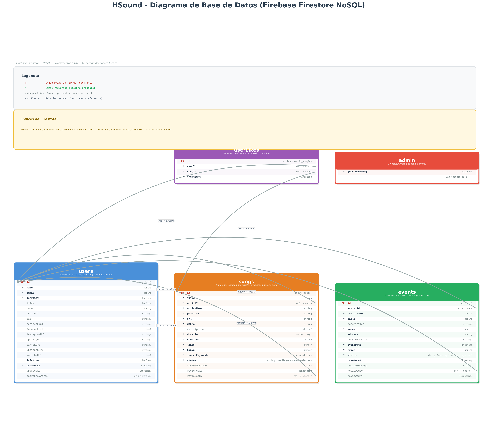

## Manual de usuario

El manual de usuario del proyecto está en [`Manual_Usuario_HSound.pdf`](Manual_Usuario_HSound.pdf).

## Estado del proyecto

| Aspecto | Estado |
|---------|--------|
| Aplicación móvil | Funcional, disponible como APK y ejecutable en local |
| Panel administrativo | Funcional y desplegado en Firebase Hosting |
| Cloud Firestore | Esquema de 5 colecciones definido y con reglas de seguridad |
| Cloud Functions | Implementada la función `syncUserEmails` |
| Pruebas | 9 archivos de prueba organizados por sprint |
| Publicación en tiendas | No realizada |

## Solución de problemas

**`flutter pub get` falla**
Verifica la conexión a internet y que Flutter esté correctamente instalado y en el `PATH`. Si sigue fallando, ejecuta `flutter clean` y repite el `flutter pub get`.

**`flutter run` indica que no hay dispositivos conectados**
Inicia un emulador de Android o conecta un celular por USB con la depuración USB activada. Revisa la lista con `flutter devices`.

**Los íconos o las imágenes no cargan**
Ejecuta `flutter clean`, luego `flutter pub get` y de nuevo `flutter run`.

**La app móvil no abre en el navegador**
Es el comportamiento esperado: la app depende de `flutter_inappwebview`, que no está soportado en web. Usa el emulador o el APK.

**El panel no carga después de un despliegue**
El hosting publica `adminpanel_musical/build/web`; si esa carpeta está vacía, compila primero con `flutter build web --release`.

**El deploy falla con un error de Firebase**
Verifica que iniciaste sesión con `firebase login` y que el proyecto activo es el correcto con `firebase use`.

## Notas de seguridad

Este repositorio es público, por lo que conviene tener presentes los siguientes puntos antes de operar el proyecto:

- **Correos de administrador en el código.** La función `isAdmin()` de `firestore.rules` y la lista `adminEmails` de `functions/index.js` incluyen direcciones de correo reales como condición de administrador. Conviene migrar esa validación al campo `isAdmin` del documento del usuario en la colección `users`, que ya está contemplado en las reglas y evita exponer datos personales en el código.
- **Lectura de la colección `users`.** Las reglas permiten que cualquier usuario autenticado lea el conjunto de documentos de `users`, lo que incluye correos y datos de contacto. Si no es necesario para el funcionamiento de la aplicación, conviene restringir la lectura al propio documento del usuario y a los perfiles públicos que el cliente necesite.
- **`firebase_options.dart`.** Contiene la configuración pública del proyecto de Firebase. No es una credencial secreta por diseño, pero conviene restringir la clave desde la consola de Google Cloud por dominio.
- **Antes de publicar** en las tiendas, revisa que las capturas y el manual no incluyan correos personales, tokens de acceso ni datos de usuarios reales.

## Preguntas frecuentes

**¿Por qué la app móvil no corre en el navegador?**
Usa `flutter_inappwebview` para reproducir contenido de YouTube, Spotify y SoundCloud, que no está soportado en web. Usa el emulador de Android, una plataforma de escritorio o el APK publicado.

**¿Cómo agrego un administrador?**
Crea el usuario en Firebase Authentication y luego, en la colección `users` de Firestore, agrega el campo `isAdmin: true` a su documento. Ese campo ya está contemplado en la función `isAdmin()` de las reglas de seguridad.

**¿Cómo se vincula una canción con su audio?**
El artista no sube el archivo de audio: registra un enlace externo a YouTube, Spotify o SoundCloud, y la app reproduce desde esa plataforma.

**¿El panel administrativo es público?**
No. Requiere iniciar sesión con una cuenta que cumpla la condición de administrador.

**¿Hay que subir `firebase_options.dart` a Git?**
Está incluido para que el proyecto funcione al clonarlo. Si prefieres no publicarlo, bórralo del control de versiones, agrégalo a `.gitignore` y genera el tuyo con `flutterfire configure`.

---

<p align="center">
  <strong>Trabajo de grado</strong><br>
  Facultad de Ingeniería, Programa de Ingeniería de Sistemas
</p>

<p align="center">
  <a href="https://www.linkedin.com/in/sofia-burbano-46a513341">
    
  </a>
  <a href="https://www.linkedin.com/in/esneyder-ibarra-rosero">
    
  </a>
</p>

<p align="center">
  <a href="https://www.umariana.edu.co">
    
  </a>
  <a href="https://hsound-8aad2.web.app">
    
  </a>
  <a href="Manual_Usuario_HSound.pdf">
    
  </a>
</p>
